  

  
  
  

## ♡ About me

Computer Science student majoring in **Networking**. I learn mostly by building practical projects, with most of my web work centred around **React + TypeScript**.

Interested in web, mobile, networking, systems, and figuring out how things work end-to-end.

## ✦ Tech stack

  

## ⌁ Selected work

<table>
<tr>
<td width="50%" valign="top">

### 🅿️ PARKUTeM
IoT + ANPR smart parking system.

`Flutter` `Dart` `Python` `ESP32`

[Repository →](https://github.com/li0kei/parkutem-mobile-app)

</td>
<td width="50%" valign="top">

### ◈ Web Platforms
Dashboards, portals, auth, APIs, and data workflows.

`React` `TypeScript` `NestJS` `PostgreSQL`

</td>
</tr>

<tr>
<td width="50%" valign="top">

### ⚛ React Builds
Interfaces, responsive UI, API integration, and frontend experiments.

`React` `TypeScript` `Vite` `Supabase`

</td>
<td width="50%" valign="top">

### ⌘ Networking
My degree focus alongside practical software projects.

`Networking` `Systems`

</td>
</tr>
</table>

  

  <code>learn → build → break → understand → rebuild</code>

